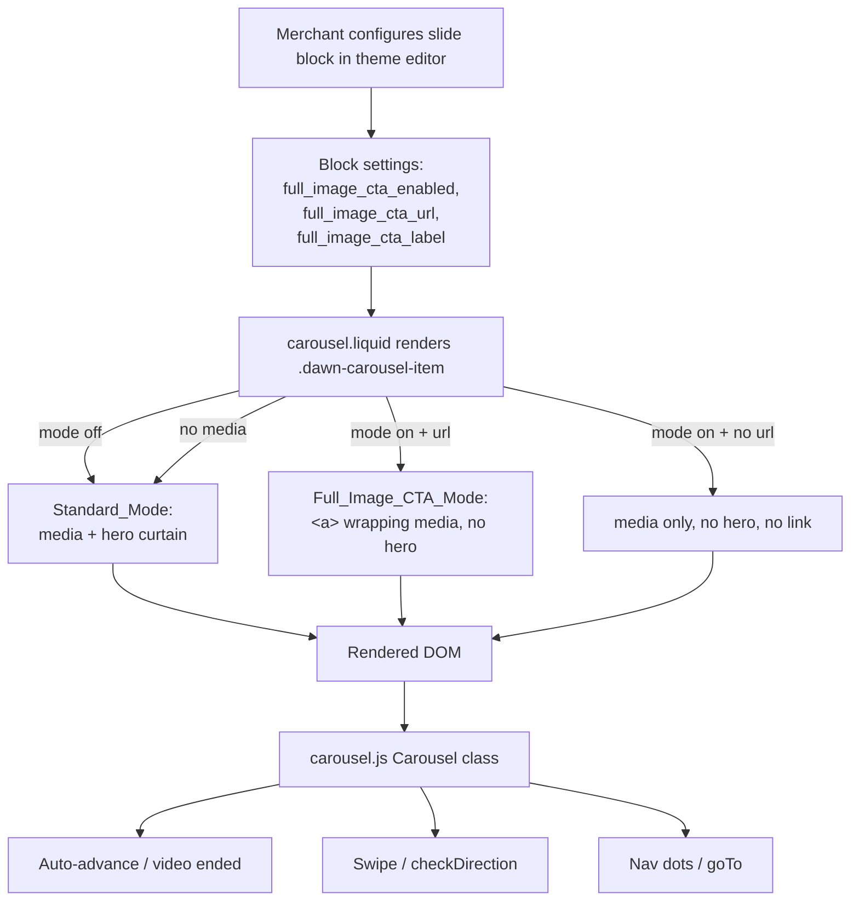
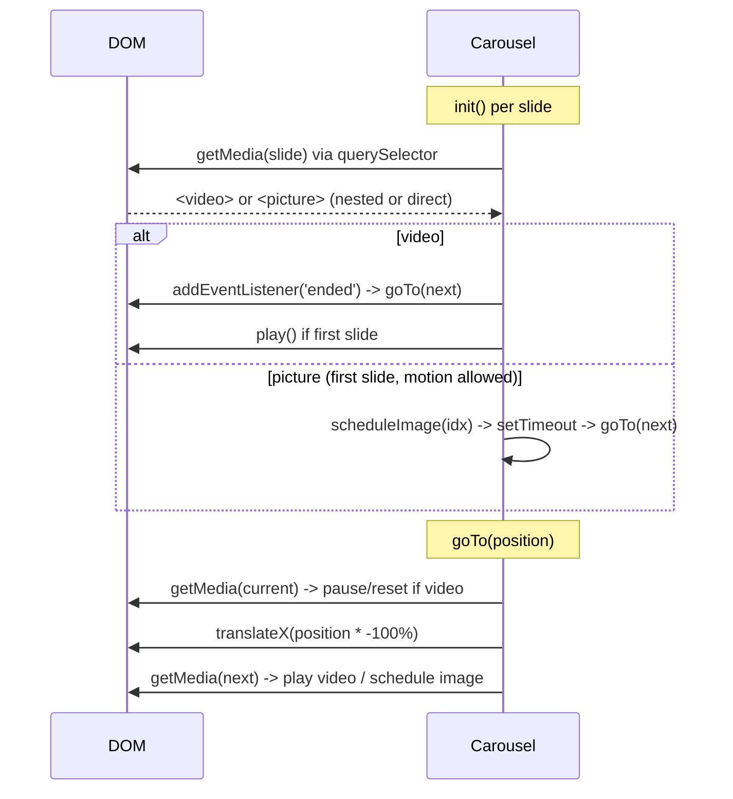

# Design Document

## Overview

This feature adds a per-Slide "full-image CTA" layout to the existing Carousel section of the Dawn theme. When a Merchant enables the mode on a slide, the entire Slide_Media (image `<picture>` or `<video>`) is wrapped in a single anchor pointing at a merchant-configured URL, and the hero curtain (gradient overlay, title, subtitle, main content, and both CTA buttons) is not rendered. Slides that do not opt in render exactly as they do today.

The work touches three files:

- `sections/carousel.liquid` — three new block settings and conditional rendering of the slide body.
- `assets/carousel.js` — a change to how the active media element is resolved so that auto-advance, video pause/play, and `goTo` continue to work when the media is nested inside an anchor.
- `assets/carousel.css` — styling so the anchor covers the full slide, the media inherits the existing fit/position rules, and the focused link shows a visible outline.

The central design risk is the JavaScript. `carousel.js` currently identifies each slide's media through `slide.firstElementChild` and branches on `instanceof HTMLVideoElement` / `HTMLPictureElement`. In full-image mode `firstElementChild` becomes the `<a>`, which is neither of those types, so auto-advance and video handling would silently stop for those slides. The design resolves the media by querying inside the slide instead of reading `firstElementChild`, which works identically whether the media is a direct child (Standard_Mode) or nested one level deep inside an anchor (Full_Image_CTA_Mode).

### Goals

- Merchant can turn a slide into a full-image link with a URL and an accessible label, defaulting off.
- The whole media area is clickable and keyboard-operable with a visible focus ring.
- Auto-advance (image timers and video `ended`), swipe, nav dots, and reduced-motion handling keep working across mixed slide types.
- Zero behavioral change for slides that do not opt in.

### Non-Goals

- No change to the hero layout, hero CTA buttons, or overlay behavior of Standard_Mode slides.
- No new carousel-level (section-level) settings; all new settings are per-slide block settings.
- No analytics, tracking, or new-tab/target behavior on the link beyond standard navigation.

## Architecture

The Carousel is a server-rendered Liquid section progressively enhanced by a small vanilla-JS class. The feature keeps that architecture: rendering decisions are made in Liquid at build time, and the JS reads the resulting DOM.



The only structural change to the DOM is an optional `<a class="dawn-carousel-cta-link">` inserted between `.dawn-carousel-item` and the media element. Everything the JS relies on (the `.dawn-carousel-item` children order for translate math, the nav items, the `data-duration` attribute) is unchanged; only the path from slide to media element gains one optional level.

### Media resolution strategy (the critical change)

Today:

```js
const media = slide.firstElementChild; // picture | video | curtain
```

New helper:

```js
getMedia(slide) {
  return slide.querySelector(':scope > a > video, :scope > a > picture, :scope > video, :scope > picture');
}
```

`querySelector` returns the first matching descendant in document order. Because a slide contains at most one media element, this reliably returns the `<video>` or `<picture>` whether it sits directly under the slide (Standard_Mode) or under the anchor (Full_Image_CTA_Mode). The three current uses of `firstElementChild` (init loop, `goTo` current media, `goTo` next media) are replaced with `this.getMedia(slide)`. The `instanceof HTMLVideoElement` / `HTMLPictureElement` checks stay exactly the same, so the branching logic is untouched.

This approach is preferred over alternatives:

- **Reading `firstElementChild` and unwrapping if it's an anchor** — works but adds a special case in three places; the query helper centralizes it.
- **Tagging media with a data attribute and selecting on it** — requires a Liquid change to every media element and a matching JS selector; the structural query needs no Liquid coordination.

## Components and Interfaces

### 1. Schema settings (`sections/carousel.liquid`)

Three settings appended to the `slide` block's `settings` array:

| id | type | default | purpose | requirement |
|----|------|---------|---------|-------------|
| `full_image_cta_enabled` | `checkbox` | `false` | Toggles Full_Image_CTA_Mode for the slide | 1.1, 1.2, 1.3 |
| `full_image_cta_url` | `url` | (none) | Link destination in full-image mode | 1.4, 2.1 |
| `full_image_cta_label` | `inline_richtext` | (none) | Accessible name for the link | 1.5, 5.1 |

Notes:

- `checkbox` in a Shopify block defaults to `false` when `default` is omitted or set to `false`, satisfying "default disabled" (Req 1.3). We set `"default": false` explicitly for clarity.
- The `url` setting type accepts Shopify URL values (products, collections, pages, external URLs) and enforces its own length limits well beyond the 2,048-character bound (Req 1.4).
- `inline_richtext` matches the existing hero-label settings in this section and renders inline markup. Because the value is used as an accessible name (an `aria-label`), the design strips it to plain text at render time (see rendering logic). Its practical length comfortably covers the 1–200 character range (Req 1.5, 5.1).

### 2. Slide rendering (`sections/carousel.liquid`)

A single mode decision computed once per slide, then two independent render branches: the media branch and the hero branch.

```liquid
{%- liquid
  assign has_media = false
  if block.settings.video != blank or block.settings.image != blank
    assign has_media = true
  endif

  assign cta_mode = false
  if block.settings.full_image_cta_enabled and has_media
    assign cta_mode = true
  endif

  assign cta_url = block.settings.full_image_cta_url
  assign cta_has_link = false
  if cta_mode and cta_url != blank
    assign cta_has_link = true
  endif

  # accessible name: label -> image alt -> url
  assign cta_label_text = block.settings.full_image_cta_label | strip_html | strip | escape
  assign cta_accessible_name = cta_label_text
  if cta_accessible_name == blank
    assign cta_accessible_name = block.settings.image.alt | escape
  endif
  if cta_accessible_name == blank
    assign cta_accessible_name = cta_url
  endif
-%}
```

Media branch (pseudocode structure):

```liquid

  <a class="dawn-carousel-cta-link" href="{{ cta_url }}" aria-label="{{ cta_accessible_name }}">
    
  </a>

  

```

The picture/video markup (including the mobile `<source>` for images and mobile/desktop video sources) is unchanged and reused verbatim in both arms. To avoid duplicating the media markup, the media markup is factored into a `...` block and emitted once inside whichever arm applies. This keeps the mobile-image `<source media="(max-width: 768px)">` intact inside the anchor, satisfying Req 2.5 and 2.6, and keeps the video sources intact satisfying Req 2.7.

Hero branch:

```liquid

  <div class="carousel-curtain" ...>
    ... existing hero title / subtitle / main / cta container ...
  </div>

```

So the hero curtain is rendered only in Standard_Mode. When `cta_mode` is true (whether or not a URL is present) the entire curtain block is omitted, satisfying Req 2.4 and 6.2. When the slide has no media, `cta_mode` is forced false, so it falls through to Standard_Mode with the full curtain regardless of the toggle, satisfying Req 6.3.

The `.dawn-carousel-item` element, its classes (`slide_position`, `slide_fit`, `color-...`), and its `data-duration` attribute are unchanged, preserving Req 3 duration handling, Req 2.8 fit/position, and Req 6.4 settings availability.

### 3. Carousel behavior (`assets/carousel.js`)

The `Carousel` class interface is unchanged. Internally:

- Add `getMedia(slide)` as described in Architecture.
- In `init()`, replace `const media = slide.firstElementChild;` with `const media = this.getMedia(slide);`. The `instanceof` branches, first-slide autoplay, video `ended` listener, and `scheduleImage` call are otherwise unchanged.
- In `goTo()`, replace both `firstElementChild` reads (current media pause/reset, next media play/schedule) with `this.getMedia(...)`.
- `checkDirection()`, `scheduleImage()`, `safePlay()`, nav-dot wiring, and the reduced-motion guard are untouched.

Because the anchor is a passthrough for clicks and does not intercept pointer or touch events, swipe detection on `.carousel-container` (Req 4.1–4.3) and nav-dot navigation (Req 4.4–4.5) keep working. A horizontal swipe still navigates; a click without a drag still activates the link, which is the expected mobile behavior for a linked banner.



### 4. Styling (`assets/carousel.css`)

New rules:

```css
/* Anchor fills the slide and does not shrink to its inline content */
.dawn-carousel-item > .dawn-carousel-cta-link {
  display: block;
  position: absolute;
  inset: 0;
  width: 100%;
  height: 100%;
  z-index: 0;
}

/* Media inside the anchor inherits the same object-fit/position rules
   as media directly under the slide. */
.dawn-carousel-item > .dawn-carousel-cta-link img,
.dawn-carousel-item > .dawn-carousel-cta-link > video {
  object-fit: cover;
  object-position: center;
  width: 100%;
  height: 100%;
  position: absolute;
  top: 0;
  left: 0;
  z-index: 0;
}

.dawn-carousel-item.left > .dawn-carousel-cta-link img,
.dawn-carousel-item.left > .dawn-carousel-cta-link > video { object-position: left; }
.dawn-carousel-item.right > .dawn-carousel-cta-link img,
.dawn-carousel-item.right > .dawn-carousel-cta-link > video { object-position: right; }
.dawn-carousel-item.fill > .dawn-carousel-cta-link img,
.dawn-carousel-item.fill > .dawn-carousel-cta-link > video { object-fit: fill; }

/* Visible keyboard focus */
.dawn-carousel-cta-link:focus-visible {
  outline: 3px solid rgb(var(--color-foreground));
  outline-offset: -3px;
}
```

The existing selectors `.dawn-carousel-item img, .dawn-carousel-item > video` still match the media in Standard_Mode. The new anchor-scoped selectors extend the same `object-fit`/`object-position` behavior to media nested inside the anchor. An alternative — broadening the existing selectors to `.dawn-carousel-item img` (descendant, already matches nested `img`) — partly works for images because the current rule already uses a descendant selector for `img`; but `video` uses the child combinator `> video`, which would not match a nested video. The explicit anchor-scoped rules make both media types behave identically and keep the intent readable. This satisfies Req 2.3 (full clickable area), Req 2.8 (fit/position), and Req 5.5 (focus indication).

## Data Models

There is no runtime data model beyond the per-slide block settings persisted by the Shopify theme editor into `settings_data.json`. The relevant per-slide settings after this change:

| setting | type | consumed by | mode relevance |
|---------|------|-------------|----------------|
| `full_image_cta_enabled` | boolean | Liquid mode decision | new |
| `full_image_cta_url` | url string | anchor `href`, accessible-name fallback | new |
| `full_image_cta_label` | inline richtext | anchor `aria-label` (stripped to text) | new |
| `image` / `image_mobile` | image ref | media render, alt fallback | existing |
| `video` / `video_mobile` | video ref | media render | existing |
| `slide_fit` / `slide_position` | enum | item class -> CSS | existing |
| `slide_duration` | number | `data-duration` -> JS timer | existing |
| `slide_overlay_alpha`, hero_* | overlay/hero | Standard_Mode only | existing |
| `color_scheme` | enum | item class | existing |

Derived (computed in Liquid, not stored):

- `has_media = image present OR video present`
- `cta_mode = full_image_cta_enabled AND has_media`
- `cta_has_link = cta_mode AND url present`
- `cta_accessible_name = label(stripped) || image.alt || url`

<!-- PBT applicability: This feature is primarily Liquid template rendering plus a
     DOM-query change in JS. The rendering logic, however, has a clear decision
     function (mode/link/accessible-name derivation) with universal properties that
     hold across all input combinations, so property-based testing applies to that
     pure decision logic. The CSS/DOM-visual aspects are covered by example and
     integration tests. Prework below classifies each acceptance criterion. -->

## Correctness Properties

*A property is a characteristic or behavior that should hold true across all valid executions of a system—essentially, a formal statement about what the system should do. Properties serve as the bridge between human-readable specifications and machine-verifiable correctness guarantees.*

The properties below target the pure decision logic derived in Liquid — the mapping from a slide's settings to (a) which render mode is chosen, (b) whether an anchor is emitted, and (c) the accessible name. This logic is extracted as a small pure function (see Testing Strategy) so it can be exercised across the full input space. DOM-visual and infrastructure concerns (clickable area, focus outline, actual browser navigation, swipe) are validated by example/integration tests, not properties.

### Property 1: Mode selection is exactly determined by toggle and media presence

*For any* combination of `full_image_cta_enabled` and media presence, the chosen mode SHALL be Full_Image_CTA_Mode if and only if the toggle is enabled AND the slide has at least one of image or video; otherwise it SHALL be Standard_Mode.

**Validates: Requirements 1.1, 1.2, 6.3**

### Property 2: Anchor emission requires mode and a URL

*For any* slide, an anchor wrapping the media SHALL be emitted if and only if the slide is in Full_Image_CTA_Mode AND a non-blank URL is configured; and when an anchor is emitted its `href` SHALL equal the configured URL.

**Validates: Requirements 2.1, 6.2**

### Property 3: Hero content is omitted exactly in full-image mode

*For any* slide, the hero curtain (title, subtitle, main content, primary and secondary CTA buttons) SHALL be omitted if and only if the slide is in Full_Image_CTA_Mode; in every other case the full hero content SHALL be present.

**Validates: Requirements 2.4, 6.1, 6.2**

### Property 4: Accessible-name fallback chain

*For any* full-image slide with an emitted anchor, the accessible name SHALL equal the stripped non-blank label when a label is present; otherwise the non-blank image alt text when alt is present; otherwise the configured URL — and the resulting accessible name SHALL never be empty.

**Validates: Requirements 5.1, 5.2, 5.3**

### Property 5: Media element is resolvable regardless of wrapping

*For any* slide that has media, the JS media-resolution function `getMedia(slide)` SHALL return the slide's `<video>` or `<picture>` element whether that element is a direct child of the slide (Standard_Mode) or nested inside the anchor (Full_Image_CTA_Mode), and SHALL return the same element type in both wrappings.

**Validates: Requirements 3.1, 3.2, 3.3, 4.4**

### Property 6: Existing structural settings are preserved across modes

*For any* slide in any mode, the `.dawn-carousel-item` SHALL carry the slide's color-scheme, slide-fit, and slide-position classes and its `data-duration` attribute (when a duration is set), identical to what Standard_Mode would produce.

**Validates: Requirements 2.8, 6.4**

## Error Handling

Rendering is defensive by construction because every branch is derived from a single mode decision:

- **Toggle on, no media** — `has_media` is false, so `cta_mode` is false; the slide renders in Standard_Mode with the hero curtain and no anchor (Req 6.3). This also means the JS `getMedia` returns `null` for that slide exactly as it does today for media-less slides, and the existing `instanceof` guards skip auto-advance for it.
- **Toggle on, media present, no URL** — `cta_has_link` is false; media renders without an anchor and the hero curtain is still omitted (Req 6.2).
- **Empty label and empty alt** — accessible name falls back to the URL, so the anchor is never nameless (Req 5.3). If the URL itself were somehow blank, no anchor is emitted at all (that path is `cta_has_link == false`), so a nameless link cannot occur.
- **Label contains markup** — `inline_richtext` may contain tags; `strip_html | strip | escape` reduces it to a plain, attribute-safe accessible name.
- **JS resolution miss** — if `getMedia` returns `null` (media-less slide), the `instanceof` checks are false and the slide is simply skipped for auto-advance, matching current behavior. No exception is thrown.
- **Reduced motion** — the existing `prefersReducedMotion` guard in `scheduleImage`/`init` still gates image auto-advance; video `ended` advancement is independent of that guard, so videos continue to advance (Req 3.4).

## Testing Strategy

The feature splits into pure decision logic (well suited to property-based testing) and DOM/visual/browser behavior (suited to example and integration tests).

### Property-based tests

- Extract the slide decision logic into a pure function, e.g. `resolveSlideRender(settings) -> { mode, emitAnchor, href, accessibleName, heroVisible }`, mirroring the Liquid derivation. This function is the unit under test for Properties 1–4 and 6.
- Extract or replicate `getMedia(slide)` against a JSDOM fixture for Property 5, building slides both wrapped and unwrapped from the same media element.
- Use a property-based testing library for the target JS toolchain — **fast-check** with the existing test runner. Do not hand-roll generators or shrinking.
- Configure each property test to run a minimum of 100 iterations.
- Tag each property test with a comment in the format: `Feature: carousel-full-image-cta-slide, Property {number}: {property_text}`.
- Implement each of Properties 1–6 with a single property-based test.
- Generators: booleans for the toggle; a small domain of URL strings including blank; label strings including blank, whitespace, and markup-bearing values; alt strings including blank; media presence as one of {image, video, none}; fit/position/color enums; optional duration.

### Example / unit tests

- Standard_Mode slide (toggle off) renders identical markup to the pre-feature output (byte-for-byte hero curtain present, no anchor) — Req 6.1.
- Toggle on with URL wraps a `<picture>` in an `<a href>` and omits the curtain — Req 2.1, 2.4.
- Toggle on with URL wraps a `<video>` in an `<a>` and preserves both mobile and desktop `<source>` elements — Req 2.5, 2.6, 2.7.
- Toggle on, no URL: media present, no anchor, no curtain — Req 6.2.
- Toggle on, no media: Standard_Mode, no anchor — Req 6.3.
- Accessible-name cases: label-only, alt-only, url-only — Req 5.1, 5.2, 5.3.

### Integration / browser tests (not property-based)

These verify DOM-visual and browser behaviors where input variation adds no value and the concern is wiring/rendering, so a small number of representative examples suffice:

- The anchor covers 100% of the slide area with no dead zones (computed layout / click at corners) — Req 2.3.
- Keyboard Tab reaches the link and Enter activates it; `:focus-visible` shows an outline — Req 5.4, 5.5.
- Auto-advance still fires for a full-image image slide after its duration, and cancels on manual navigation — Req 3.1, 3.5, 3.6.
- Full-image video slide advances on `ended`, wrapping from last to first — Req 3.2, 3.3.
- Reduced-motion disables image auto-advance but videos still advance on `ended` — Req 3.4.
- Swipe left/right and vertical-scroll rejection on a full-image slide — Req 4.1, 4.2, 4.3.
- Nav dots: one per slide including full-image slides, and clicking navigates — Req 4.4, 4.5.

### Unit-testing balance

Property tests carry the burden of covering the combinatorial input space for the decision logic. Example tests pin a handful of concrete renders and the exact backward-compatible Standard_Mode markup. Integration tests cover the browser behaviors that cannot be expressed as universally quantified properties over pure inputs.
